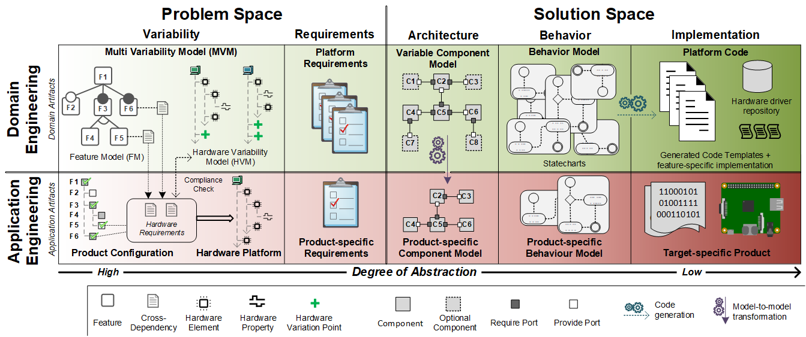

# Amalthea Variability Management
The plug-ins in this repository have been created in the context of the ITEA project [AMALTHEA4Public](https://itea3.org/project/amalthea4public.html),
which aim is to suciently support the creation of embedded multi- and many core system architectures. Therefore, the Eclipse project [APP4MC](https://itea3.org/project/amalthea4public.html) provides an open source tool platform for model-based engineering of embedded multi- and many-core systems. Automotive development processes are supported in APP4MC by, among other things, the integration of requirements engineering, variability management, traceability, model validations, workflows, and modeling editors.

Variability management is realized on top of APP4MC and spans several stages of the development lifecycle. Therefore, it is divided into domain and application engineering as well as a problem and solution space. The domain engineering dimension captures all the domain knowledge, i. e. common and variable features of a group of related products, via appropriate models,
while application engineering is responsible to derive products based on customer demands.
Within the problem space, the scope is stored, i. e. specifications established during the domain analysis and requirements engineering. By contrast, the solution space refers to core assets, e. g. components or code, which form the concrete product. The following figure depicts an abstract view on the variability framework:

<div style="text-align:center"></div>

## AMalthea Product Line Engineering (AMPLE) Framework

System variability is a cross-cutting concern and affects all abstraction levels and artifacts in the domain engineering dimension. Within the AMalthea Product Line Engineering (AMPLE) framework (cf. *org.itea2.amalthea.variability.ample*), variability is managed via the Multi Variability Model (MVM).
For this purpose, the MVM integrates two kinds of variability models, where each model takes different characteristics of particular disciplines like software or hardware into account. While both model represents common and variable parts of a system, they slightly differ in their notation as well as focus. The following figure shows the AMPLE metamodel:

<div style="text-align:center"></div>

### Feature Model

Feature models (FMs), as one type of variability model, consists of a hierarchical arranged set of features connected through different types of association (*Mandatory, Optional, Or, Alternative (XOR)*).
The features of a FM denotes system properties relevant to some stakeholder, which can be further decomposed by refined features.
FMs are widely used in industry to capture and manage variability throughout the entire development process.
Therefore, a FM covers several variation points, which are bound during the product configuration process and resulting in a single product.
Beside these hierarchical relationships, cross-tree constraints are realized by require and exclude (mutual-exclusion) constraints. Due to this, FMs are suitable to represent variant-rich system parts like software.

### Hardware Variability Model

Since hardware platforms typically have only few variants, the Hardware Variability Model (HVM) focuses on the description of available properties and the corresponding hierarchical structure. In particular, the HVM abstract from the associations of a FM and use a simple tree structure instead to cover the hierarchy of a hardware platform along with its elements and properties. Properties captures distinct system characteristics like the clock rate of a CPU in a standardized way. As a HVM consists of a typed hierarchical structure, properties are clearly identifiable. For example, a property Size 8KB can refer to a distinct hardware element, such as a Flash memory, of a superior microcontroller, which again is part of a hardware platform. Variability in a HVM is described through specific variation points, which defines the element that should be changed and in addition the structure and properties that must be added or removed. For instance, a variation point could extend the hardware platform with a SPI bus. Within a HVM, dependencies can be defined between variants by means of require and exclude constraints.

### Product Configuration

A product configuration represents a set of chosen features to form a specific product.
In particular, the resulting customized product forms a subset of the domain artifacts by binding all variation points in domain engineering.
A variation point indicates variability, i. e. it indicates a choice in application engineering between a set of domain artifacts.

### Dependencies

Both models can be further annotated with dependencies among each other. This is due to the fact that dependencies between software, hardware, and further system parts like operating system arises during the development activities, which is demonstrated in the following figure:

<div style="text-align:center"></div>

An EBNF-based grammar provides the basis for modeling such loosely coupled cross-dependencies between system parts:

```
Dependency = FlatDependency || (HierarchicalDependency, {'||', HierarchicalDependency});

FlatDependency = SystemPart, '.', Property;
HierarchicalDependency = ['(Exclusive)'], SystemPart, {'.', StructureElement},
'=(' Property, {',', Property}, ')';

SystemPart = Name;
StructureElement = Name;
Property = Name, [ComparismOperator, Value], [Description];
ComparismOperator = ('=' | '>' | '<'| '<='| '>=');

Name = {(Lowercase | Uppercase | Numbers)};
Value = {(Lowercase | Uppercase | Numbers)};
Description = '(', {(Lowercase | Uppercase | Numbers)}, ')';
```

The grammar makes use of two different types to describe dependencies: On the one hand *FlatDependency* (dependencies towards feature models) an on the other hand *HierarchicalDependency*, which is suitable to describe requirements towards HVMs. Both definitions start with the intended system part, whereby logical operators (disjunction) can further connect hierarchical dependencies. This allows the description of alternative dependencies (e.g. a operating system needs either a bitwidth of 16 or 32). Furthermore, it is possible to annotate a *HierarchicalDependency* with an '(Exclusive)' with the result that properties of such dependencies are exclusively available for one source. An example for an exclusive dependency is an operating system, which needs at least 512KB of memory size on its own. Such properties have to be reserved by the target. Thus, they become additive properties, which means that they are summed up during configuration.

An exemplary cross-dependency could be ```Hardware.Microcontroller.Sensor=(Type=TEPT4400)```, which denotes that the according software features requires a certain sensor type. The modeling of such depdencies in AMPLE is realized via Xtext and Yakindu (cf. *org.itea2.amalthea.variability.dependency*).

[Xtext](https://eclipse.org/Xtext/) denotes an open-source framework for developing domain-specific languages and has been used for implementing the ENBF grammar, while [Yakindu](https://marketplace.eclipse.org/content/yakindu-statechart-tools) provides the integration of Xtext with EMF (cf. *org.itea2.amalthea.variability.util*). For using the Xtext grammar within AMPLE, the *description* property of a *Dependency* instance can be used:

<div style="text-align:center"></div>

Using this kind of dependencies simplifies an exchange of system parts and enables automatic verification of compliance with the appropriate requirements of a system part. The compliance checking process for different system parts is as follows: Initially, cross-dependencies of each selected feature are stored in a tree-based structure. Afterwards, these system requirements are checked via the compliance check algorithm against suitable system parts. Although the processing of such dependencies is not implemented in AMPLE yet, the following figure conceptually demonstrate the resolving of cross-dependencies, detection of mismatches, and derivation of product configurations:

<div style="text-align:center"></div>


## Variable Component Model (VaCoMo)

While it is not feasible to manage an architecture model for each variant of a SPL, we introduced the Variable Component Model (VaCoMo) to cover all product
variants within a so-called 150% model.
Based on a product configuration,
this enables the derivation of product-specific component
models by removing optional components and ports like the High
Beam Assistant.
Therefore, VaCoMo extend common component models with structures to cover variability: Optional features can be represented by components and ports marked as optional, while an exclusive-or (XOR) is mapped to a Variation Point, which again aggregates a set of optional components.
In case components of a Variation Point share the same target port, Variable Connectors can be used.
Apart from the variability related structures, VaCoMo make use of common structures: Components represents functional units and are further
divided into Hierarchical, Atomic, and Sensor/Actuator types.
Furthermore, the interfaces of a component can be described via appropriate ports, while connectors allows to connect components among each other via compatible ports.
Additionally, model-to-model transformations allows different output
formats, e. g. *AMALTHEA* or *AUTOSAR*, for the resulting productspecific component model.

<div style="text-align:center"></div>

## The Car Headlight Case Study

To have a basis for discussion and evaluation, the car headlight case study provides several example models and artifacts for the development of variable embedded systems.
A common and widely used development methodology in the automotive domain is the V-model due to its applicability for large projects with different involved parties.
For example, automotive standards like AUTOSAR or ISO 26262 are applicable to this life cycle model.
The following figure depicts an abstract view on the V-model including the software development activities on the left side and the testing activities on the right side.

<div style="text-align:center"></div>

For the car headlight we focused on the left side of the V-model and included different development phases from preliminary system analysis to implementation.
Thereby, each phase comprises specific models and artifacts.
Due to different customer requirements as well as specific laws and regulations within the diverse market segments, the car headlight is offered in various product configurations.
Therefore, it consists of mandatory features like a high beam or a parking light, which are present in all product configurations.
On the other hand, optional features can be chosen during the product configuration to extend the base product functionality.
For example, the high beam can be upgraded with an assistant to automatically adjust the
range of the light beam, while the static cornering light provides additional lights to better illuminate curves when turning.
The daytime running light (DtRL) is also an optional feature as it is required in some countries whereas other countries prohibit it.
Furthermore, the turn signal can be either a standard or a LED light chaser, while the high beam assistant requires also a DtRL due to hardware constraints.

Each development phase of the car headlight will be shortly described in the following. Note that state charts and c files in the case study folder (cf. *Car.Headlight.Case.Study*) are just dummy files.

### System Variability
Variability management is a cross-cutting concern and affects all development activities in domain engineering. Thus, we will also make use a Feature Model for storing and managing the variability of the car headlight software.
As the car headlight is offered in different product variants, several variation points exists, e. g. the Alternative feature group *Turn Signal* expresses the decision between a *Standard* or *Dynamic* turns signal. This variability is bound in application engineering via a product configuration to form a specific
and customized product.
The following figure depict a feature model for a car headlight on the right side and its appropriate representation within the AMPLE editor on the right side:

<div style="text-align:center"></div>

The car headlight software further runs on a 32 bit Infineon XMC4500 board with a 120 MHz core, 1024 KB
of flash memory, and several sensors. Thereby, the variation point *DaytimeRunningLight* may extend the
board with a sensor to realize the DtRL feature if required.
The following figure depict an example HVM for a car headlight:

<div style="text-align:center"></div>

### System Requirements
Requirements provides the base for domain engineering as well as verification and validation of the system.
Especially in the automotive domain, functional safety has to be ensured by appropriate specifications, e. g. ISO 26262.
Among others, ISO26262 stipulate that requirements have
to be verified, i. e. it has to be shown that the implementation
fulfills the requirements.
Instead of using plain text, e. g. a word document, the requirements in this case study have been modeled with ReqIF Studio5, a free requirements engineering tool which is part of the Eclipse Requirements Modeling Framework (RMF) and thus based on the Requirements Interchange Format (ReqIF).
ReqIF provides attributes like a name or a description and further allows
to add custom attributes, e. g. to mark requirements as optional or
to add an author.
The following Figure shows an extract of functional requirements for the car headlight, which will begradually implemented in the subsequently abstraction levels.

<div style="text-align:center"></div>

### System Architecture
System design decompose the system into logical parts (components) and their relationships (ports and conncectors).
The following figure shows the car headlight architecture including the different variants like the optional *High Beam Assistant* component or the variable connector for the *Turn_Signal_Type*.

<div style="text-align:center"></div>

### System Behaviour
While the previous development phases covered the overall system architecture,
this phase represents the design activity of the V-model by means of statecharts as one kind of behavior model.
Thereby, each statechart reflects the according component along
with their required/provided ports.
For modeling the statecharts, YAKINDU Statechart Tools7, a commercial modeling
environment initially designed for the embedded systems industry with simulation and code generation (Java, C, C++) facilities based on Eclipse, has been used.

### System Implementation
The implementation level of the car headlight represents the lowest
abstraction level.
Therefore, domain engineering comprises a repository of hardware drivers, e. g. for controlling the LEDs, as well as C code.
The code is based on templates, which have been generated
by using the statecharts, and is further enhanced
with feature-specific implementations.
Additionally, #ifdef statements allows it to handle internal variability, e. g. the flashing interval of the turn signal. Within application engineering,
target-specific code is produced by reusing the C code from domain
engineering and incorporating required hardware drivers.

<div style="text-align:center"></div>

## Traceability
Traceability management supports the establishment and management of specific associations, called traceability links, between a set of source and target artifacts involved in the development process to enable collaborative work
environments and make the relationships between the artifacts and
thus the relationships between the disciplines explicit.
For the car headlight, we draw on Capra as traceability management tool.
The following figure depict the resulting traceability model (cf. *org.eclipse.capra.variability.traceabilitymodel*).

<div style="text-align:center"></div>

Traceability links modelled in this way allows for several operations like the conduction of analysis or the derviation of product-specific models as shown in the following figure:

<div style="text-align:center"></div>

## Getting started

### Prerequisite

AMPLE and VaCoMo are running on top of the Eclipse IDE and the Eclipse Modeling Framework:

* [EMF](https://www.eclipse.org/modeling/emf/)

The formalized modeling of dependencies further requires the following plug-ins:

* [Xtext](https://eclipse.org/Xtext/)
* [Yakindu](https://marketplace.eclipse.org/content/yakindu-statechart-tools)

For altering the underlying metamodels, Xcore can be used:

* [Xcore](http://download.eclipse.org/modeling/emf/emf/updates/nightly/)

For traceability management, Capra is suitable:

* [Capra](https://projects.eclipse.org/proposals/capra)

The [Eclipse Modeling package](https://www.eclipse.org/downloads/packages/eclipse-modeling-tools/oxygenr) already comprises these plug-ins (except Yakindu, which is used for integrating Xtext and EMF editors, as well as Capra).

### Modeling with AMPLE

For creating and editing variability models, AMPLE provides either a creation wizard ("AMALTHEA Variability Management") or one can create a new file with *.ample* extension:

<div style="text-align:center"></div>
